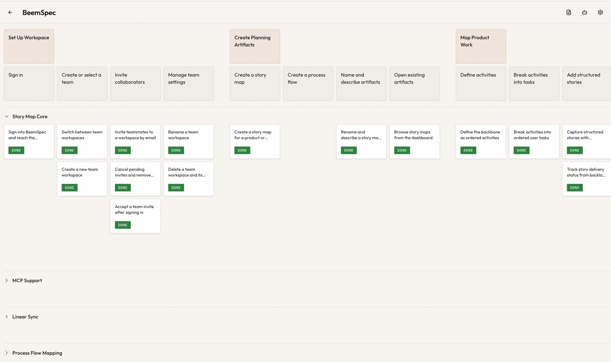
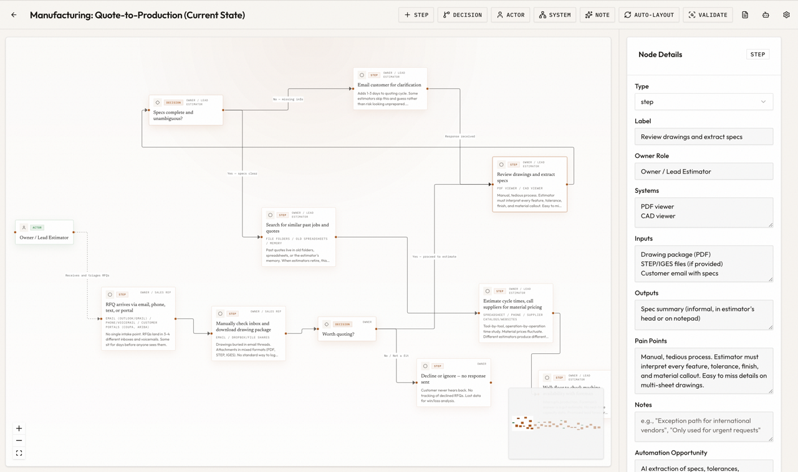

# BeemSpec

BeemSpec is a planning context system for software teams.

It gives teams a structured way to map user journeys, operational processes, and implementation work, then makes that context available to coding agents through MCP. The goal is simple: better alignment before work starts, and better implementation output once work moves into execution.

## Why it exists

Most teams still split planning across too many surfaces.

- Story maps or workshop boards live in one place
- Process knowledge lives in docs, diagrams, or people's heads
- Tickets live in an issue tracker
- Coding agents see only a thin slice of the real context

That usually creates two problems.

First, stakeholders align in the workshop and then lose that shared picture once the work gets broken into tickets.

Second, the planning artifact goes stale because keeping it current takes too much manual effort.

BeemSpec is built to close that gap.

## How to use it

### Story mapping

One common pattern looks like this:

1. Connect the BeemSpec MCP server to Claude, ChatGPT, OpenCode, Codex, or Claude Code.
2. Discuss the product with the team.
3. Feed the meeting transcript or notes to an agent.
4. Have the agent organize the discussion into a story map in BeemSpec.
5. Review the map together and make adjustments.
6. Let coding agents pull the full context through MCP during implementation.

This works well because the team does not have to manually translate every conversation into fully formed stories up front. The map becomes the shared planning structure, and agents can keep working from that same structure later.

> "This example story map shows how raw workshop input becomes clear, release-ready implementation slices."

### Process flows and workflow automation

Another common pattern looks like this:

1. Interview the people doing the work and capture detailed notes about systems, tools, handoffs, and failure points.
2. Feed the transcript or notes to an agent.
3. Have the agent map the operational process flow in BeemSpec.
4. Review the process flow with the operators and correct anything that is missing or inaccurate.
5. Use the process flow as the basis for designing and deploying workflow automations.

This is where process modeling becomes more than documentation. The map can help teams spot bottlenecks, clarify ownership, and hand a much better representation of the workflow to automation tools and coding agents.

> "This example process flow turns operational complexity into an automation-ready model with clear handoffs and constraints."

## What BeemSpec does

BeemSpec combines three things that are usually separate.

### 1. Story maps for planning the product

BeemSpec uses a structured, Jeff Patton-style story map model.

You can organize work around activities, tasks, stories, releases, and personas instead of dropping notes onto a generic canvas.

Stories carry structured implementation context such as user story text, acceptance criteria, edge cases, design links, and technical guidelines.

This gives teams a better way to talk about what should ship, why it matters, and how to slice it into releases.

### 2. Process flows for understanding how work really moves

BeemSpec also supports process flow mapping as a first-class planning artifact.

That matters because product work does not happen in isolation.

Teams often need to understand approvals, handoffs, systems, failure cases, bottlenecks, and automation opportunities before they can make good roadmap or implementation decisions.

Process flows in BeemSpec are meant to capture operational reality clearly enough that product, operations, and engineering can work from the same model.

### 3. MCP for giving coding agents real planning context

BeemSpec exposes its planning model through MCP.

That means coding agents can pull:

- story-level context
- release-level context
- story map context
- process flow context

instead of relying only on ticket text or a copied prompt.

This is one of the main ideas behind the product. BeemSpec is not just a place to create planning artifacts. It is a structured context layer that helps coding agents understand the end-to-end flow around the work they are implementing.

## How it fits with Linear

BeemSpec is not trying to replace an execution system like Linear.

The intended split is:

| System | Job |
| --- | --- |
| `BeemSpec` | planning context, story maps, process flows, release structure |
| `Linear` | issue tracking, project execution, delivery coordination |
| coding agent | implementation work in the local development environment |

BeemSpec includes a Linear integration layer with team OAuth, status mapping, project mapping, automatic sync, webhook ingestion, and story import/sync flows.

Linear is where teams run execution, while BeemSpec is where teams keep the richer planning and process context that execution depends on.

## What is different about this approach

There are good tools for story mapping, good tools for roadmapping, good tools for issue tracking, and good tools for whiteboarding.

What is usually missing is a system that does all of the following at once:

- supports real story mapping instead of a loose template
- supports process modeling without forcing teams into a generic whiteboard
- keeps planning context structured enough to be useful to coding agents
- stays connected to downstream execution systems

That is the gap BeemSpec is trying to fill.

## The maintenance problem

One of the hard truths about story maps and similar planning artifacts is that they are valuable when they are current and easy to ignore when they are not.

BeemSpec does not magically remove the need for discipline, but MCP changes the maintenance cost.

Instead of rewriting stories, reshuffling releases, and editing context by hand, teams can use LLMs to update and reshape the model conversationally. That makes it much more realistic for the artifact to stay alive after the initial workshop.

## Current capabilities

- Structured story map editing with activities, tasks, stories, releases, and personas
- Process flow modeling with nodes, edges, validation, and operational metadata
- Team collaboration with invites, ownership, and team-scoped workspaces
- MCP server for reading and mutating planning data through agent tools
- Free-form story, release, map, and process context for coding agents
- Linear integration with OAuth, webhook handling, project/status mapping, sync, and import

Linear outbound sync is queued transactionally in Supabase. Story saves return
without waiting on Linear, Next.js makes an immediate post-response attempt,
and `npm run sync:drain` provides a portable recovery command for a scheduled
job. Configure `INTEGRATION_SYNC_SECRET` in the app and scheduler, plus
`SYNC_DRAIN_URL` (or `APP_URL`) in the scheduler. A 15-minute DigitalOcean App
Platform scheduled job is sufficient for recovery; the queue remains durable
between runs. Terminal queue messages are deleted after their outcome is
recorded, processed webhook receipts are retained for 30 days, and failed
receipts are retained for 90 days.

## Tech stack

- Next.js
- React
- TypeScript
- Supabase
- PostgreSQL with row-level security
- MCP SDK
- Tailwind CSS
- Radix UI
- Vitest
